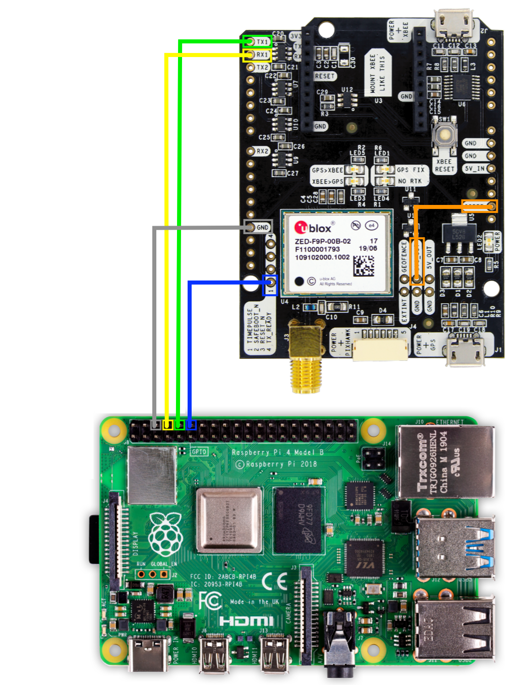

# GalMon and Stratum 1 clock with an ArduSimple simpleRTK2B
Author: Stijn Jonker - sjcjonker+gm@sjc.nl - Version: 1 
---

## Introduction
When I decided I wanted to contribute to the GalMon project I ordered an [ArduSimple simpleRTK2B](https://www.ardusimple.com/product/simplertk2b-basic-starter-kit-ip65/) starter kit. This board contains a [u-blox ZED-F9P](https://www.u-blox.com/en/product/zed-f9p-module) receiver / GGNS module. I started to provide data because I wanted to learn about satellite based location systems and associated items (actually still learning...) **AND** I wanted a [NTP stratum 1](https://en.wikipedia.org/wiki/Network_Time_Protocol) server for my home network/lab. As an accurate time is imported, but also time with all the aspects like timezone, daylight saving, leap seconds and all other crazy things time is an extremly complex topic to master and to not make mistakes when troubleshooting / investigating in my day job.

Anyway I got GalMon/ubxtool running quite quickly via the USB port only then to find out that you cannot run the [gpsd](https://gpsd.gitlab.io/gpsd/index.html) and [chrony](https://chrony.tuxfamily.org) (a modern NTP daemon) at the same time, in the default setup with the simpleRTK2B, just connecting via the USB interface.

So initially I opened a [issue](https://github.com/ahupowerdns/galmon/issues/102) on GalMon to expose an [Pulse Per Second](https://en.wikipedia.org/wiki/Pulse-per-second_signal) (PPS) signal next to an [SHM driver](https://github.com/ahupowerdns/galmon/issues/100) for ntpd / chrony. The feedback on my issue this wasn't really doable, but also there was a hardware way. This short write-up is to show how I have done just this.

To allow your Raspberry PI to function as an NTP stratum 1 clock its best to have multiple time sources, simply said to keep them in balance and assure the right time is propagated. This to prevent an issue with a single source to throw off the system clock and when acting as a time server all associated clents. Via the [gpsd](https://gpsd.gitlab.io/gpsd/index.html) daemon together with a PPS signal you can achieve high time accuracy within your time synchronisation software, especially when coupled with public NTP servers. Nowadays most systems use the [NTP protocol](https://en.wikipedia.org/wiki/Network_Time_Protocol) to sync the time and stay accurate. This is often done by ntpd or chrony on Linux or \*nix systems, whereby chrony is a more or less recent attempt to provide an alternative, and a more secure alternative, to ntpd.

This writeup shows how to connect the TimePulse PPS and [UART](https://en.wikipedia.org/wiki/Universal_asynchronous_receiver-transmitter) (simply said an serial port) from the simpleRTK2B/u-blox ZED-F9P to an Raspberry PI and allow this RaspberryPI to run as an stratum 1 NTP source for your home network.

::NOTE:::if you still need to order your simpleRTK2B then I'm **guessing** you can connect the simpleRTK2B to the Raspberry PI without soldering when you order the simpleRTK2B with the headers. It might be worth to try.

## Hardware setup
The ZED-F9P on the simpleRTK2B provides besides the exposed USB connection also an UART and an TimePulse signal, when you connect those to the right GPIO connectors on a Raspberry PI you can receive input for both gpsd via a serial port and a PPS signal for chrony.

We need to connect some wires to the simpleRTK2B via soldering to connect it to the Raspberry PI GPIO and one wire on the simpleRTK2B board itself to select the right voltage level (3.3V) between the two devices.

### simpleRTK2B / Raspberry PI connectors/wires
- UART1 TX of the ZED-F9P to Raspberry UART TX is shown in green
- UART1 RX of the ZED-F9P to Raspberry UART RX is shown in yellow
- GND of the simpleRTK2B to Raspberry GND is shown in grey
- TimePulsse of the ZED-F9P to Raspberry PCM_CLK is coloured blue
- The IOREF path on the simpleRTK2B is shown in orange, this selects 3.3V as voltage. Connecting it **wrongly** (to the 5V output or otherwise) could damage your Raspberry PI.


## Software setup
Now that the physical hardware part is done, the Raspberry PI itself need to be configured to disable Bluetooth, as the Bluetooth module uses the UART we just connected to. For this one should edit the config.txt, which can be found in `/boot/config.txt`.

Under a section [all] there should be the following entries:
```
# Enable the UART for the use with the simpleRTK2B
enable_uart=1
# Disable Bluetooth, as this used the uart exclusively
dtoverlay=disable-bt
# Enable the pps signal and indicate it's on GPIO PIN 18.
dtoverlay=pps-gpio,gpiopin=18
```
Now to make sure this is parsed and not overruled by a later statement, the safest way is to add this to the end of the file.

Next for the module for the pps singal to be loaded, for this edit `/etc/modules` and make sure on there is the following in the file (leave all other items as-is):
```
# Load pps_gpio for the simpleRTK2B TimePulse signal.
pps_gpio
```

Then reboot the Raspberry PI; to disable Bluetooth and configure the PPS settings. Once rebooted check if the uart and pps is correctly loaded and working.

### PPS signal check
The linux kernel messages can be read from it's ring buffer with dmesg, to find the pps related message run: `dmesg | grep pps` then on my Raspberry PI the output is shown as:
```
root@raspberrypi:/boot# dmesg | grep pps
[    4.177390] pps_core: LinuxPPS API ver. 1 registered
[    4.178898] pps_core: Software ver. 5.3.6 - Copyright 2005-2007 Rodolfo Giometti <giometti@linux.it>
[    4.190231] pps_ldisc: PPS line discipline registered
[    5.455744] pps pps0: new PPS source pps@12.-1
[    5.455833] pps pps0: Registered IRQ 166 as PPS source
```

Now to be sure please install the package `pps-tools` if not yet installed with the command: `apt intall pps-tools` part of this package is `ppstest` which is listed as "ppstest: PPSAPI interface tester".

Now you can check whether the pps signal is detected correctly:
```
root@raspberrypi:/boot# ppstest /dev/pps0
trying PPS source "/dev/pps0"
found PPS source "/dev/pps0"
ok, found 1 source(s), now start fetching data...
source 0 - assert 1582286566.999999077, sequence: 65588 - clear  0.000000000, sequence: 0
source 0 - assert 1582286567.999998716, sequence: 65589 - clear  0.000000000, sequence: 0
source 0 - assert 1582286569.000001741, sequence: 65590 - clear  0.000000000, sequence: 0
^C
```

### uart output check via gpsd
To verify the uart is now enabled and available this can also be done with `dmesg`, you can use: `dmesg | grep serial` on my Raspberry PI it shows as:
```
root@raspberrypi:/boot# dmesg | grep serial
[    0.814261] uart-pl011 3f201000.serial: cts_event_workaround enabled
[    0.815793] 3f201000.serial: ttyAMA0 at MMIO 0x3f201000 (irq = 81, base_baud = 0) is a PL011 rev2
[   90.037958] uart-pl011 3f201000.serial: no DMA platform data
```

Checking the uart output can be done via various terminal applications, however most Raspberry PI's don't have these installed, so the best approach could be to do this by configuring gpsd, install gpsd via: `apt install gpsd`

The serial port is shown above as ttyAMA0, as such we can include this in the gpsd configuration in `/etc/default/gpsd`, 
```
# Default settings for the gpsd init script and the hotplug wrapper.

# Start the gpsd daemon automatically at boot time
START_DAEMON="true"

# Use USB hotplugging to add new USB devices automatically to the daemon
USBAUTO="false"

# Devices gpsd should collect to at boot time.
# They need to be read/writeable, either by user gpsd or the group dialout.
DEVICES="/dev/ttyAMA0"

# Other options you want to pass to gpsd
GPSD_OPTIONS="-n -b"
```
For the `GPSD_OPTIONS` I decided amongst the lines of better safe then sorry to not allow gpsd to configure the u-blox ZED-F9P module by specifying `-b` the `-n` option tells gpsd to start getting a location fix and as such a accurate time before any client connects to gpsd, which seems like a nobrainer to me.

The next step is to enable and start gpsd on the Raspberry PI via the below command:
```
root@raspberrypi:/boot# systemctl enable --now gpsd
Synchronizing state of gpsd.service with SysV service script with /lib/systemd/systemd-sysv-install.
Executing: /lib/systemd/systemd-sysv-install enable gpsd
Created symlink /etc/systemd/system/multi-user.target.wants/gpsd.service ? /lib/systemd/system/gpsd.service.
Created symlink /etc/systemd/system/sockets.target.wants/gpsd.socket ? /lib/systemd/system/gpsd.socket.
```

In case an error occurs, the startup error can most likely be seen with: `journalctl -u gpsd`

Most likely there is no fix yet on the GPS module, but you can check the status of the gpsd daemon and GPS module with the `cgps` command. If you want to see all messages received over the serial port, then you can just run `cgps` and the raw output is also printed, below is the output of `cgps -s` to just show the status:
```
┌───────────────────────────────────────────┐┌─────────────────────────────────┐
│    Time:       2020-02-21T12:19:21.000Z   ││PRN:   Elev:  Azim:  SNR:  Used: │
│    Latitude:    56.27193166 N             ││ 124    65    076    00      Y   │
│    Longitude:    3.61930849 E             ││ 205    12    120    00      N   │
│    Altitude:   4.100 m                    ││ 208    06    066    39      N   │
│    Speed:      0.01 kph                   ││ 210    12    057    34      N   │
│    Heading:    2.1 deg (mag)              ││ 211    11    023    43      N   │
│    Climb:      0.00 m/min                 ││ 213    00    087    00      N   │
│    Status:     3D FIX (11 secs)           ││ 219    41    268    00      N   │
│    Longitude Err:   +/- 5 m               ││ 220    26    208    00      N   │
│    Latitude Err:    +/- 7 m               ││ 222    18    323    00      N   │
│    Altitude Err:    +/- 18 m              ││ 223    13    080    00      N   │
│    Course Err:      n/a                   ││ 227    05    148    00      N   │
│    Speed Err:       n/a                   ││ 228    25    101    00      N   │
│    Time offset:     1.001                 ││                                 │
│    Grid Square:     JO22hg                ││                                 │
└───────────────────────────────────────────┘└─────────────────────────────────┘
```

Once you see this `cgps` output whilst `ubxtool` is also correctly running then you have both the GalMon monitoring active and all pieces ready to also run the NTP stratum 1 clock.

## Configuring chrony daemon
As this guide is using chrony, please make sure ntp is removed and chrony is installed by running: `apt delete ntpd` and `apt install chrony` depending ont he state of your Raspberry PI it could be this is already in the correct state.

The chrony daemon is configured via `/etc/chrony/chrony.conf` the majority of the config can remain as default, then add the following to the file:
```
# SHM0 is a shared memory driver / connection from gpsd
refclock SHM 0  delay 0.5 refid NEMA

# PPS is from the /dev/pps0 device.
refclock PPS /dev/pps0 refid PPS

## Now add your network ranges here to allow syncing to your chrony instance
allow 192.0.2.0/24
allow 2001:DB8:DB8::/48
```

Enable and start chrony with the following command:
```
root@raspberrypi:~# systemctl enable --now chrony
Synchronizing state of chrony.service with SysV service script with /lib/systemd/systemd-sysv-install.
Executing: /lib/systemd/systemd-sysv-install enable chrony
```

Just let is all run for some time to get a Galileo / BeiDou / Glonass / GPS etc fix and then chronyc should show something along the lines of:
```
root@raspberrypi:~# chronyc sources -v
210 Number of sources = 6

  .-- Source mode  '^' = server, '=' = peer, '#' = local clock.
 / .- Source state '*' = current synced, '+' = combined , '-' = not combined,
| /   '?' = unreachable, 'x' = time may be in error, '~' = time too variable.
||                                                 .- xxxx [ yyyy ] +/- zzzz
||      Reachability register (octal) -.           |  xxxx = adjusted offset,
||      Log2(Polling interval) --.      |          |  yyyy = measured offset,
||                                \     |          |  zzzz = estimated error.
||                                 |    |           \
MS Name/IP address         Stratum Poll Reach LastRx Last sample
===============================================================================
#- NEMA                          0   4   377    14   +178ms[ +178ms] +/-  254ms
#* PPS                           0   4   377    15   -331ns[ -345ns] +/-  555ns
^- ntp0.example.com              2   6   377    41   +410us[ +410us] +/-   13ms
^- ntp1.example.com              2   6   377    42    +68us[  +68us] +/-   41ms
^- ntp2.example.com              2   6   377    42   +321us[ +321us] +/-   41ms
^- ntp3.example.com              2   6   377    41   +131us[ +131us] +/-   38ms
```
Please note the number of network based sources (prefixed with ^) can differ (and obviously I substituted the actual hostnames). Here you see we have 2 local sources, based on # in front of the sources "NEMA" and "PPS" whereby the system is synchronised on the second pulse received presently.

You now have a Stratum 1 NTP server at your disposal, point the other hosts in your network to this Raspberry PI's IP address or hostname (if you run DNS locally). 

## Using your new time server
I would recommend to always have more then one time source, so I recommend adding your new server to the other hosts in your home network. For chrony or ntpd add a line:
`server 192.0.2.123 prefer` to your `chrony.conf` or `ntp.conf` on those systems they should report it as a Stratum 1 server, see the output of chrony and ntpd on some of my other servers:

**chrony based output:**
```
[root@otherlinuxserver1 ~]# chronyc sources -v
210 Number of sources = 9

  .-- Source mode  '^' = server, '=' = peer, '#' = local clock.
 / .- Source state '*' = current synced, '+' = combined , '-' = not combined,
| /   '?' = unreachable, 'x' = time may be in error, '~' = time too variable.
||                                                 .- xxxx [ yyyy ] +/- zzzz
||      Reachability register (octal) -.           |  xxxx = adjusted offset,
||      Log2(Polling interval) --.      |          |  yyyy = measured offset,
||                                \     |          |  zzzz = estimated error.
||                                 |    |           \
MS Name/IP address         Stratum Poll Reach LastRx Last sample
===============================================================================
^* 192.0.2.123                   1   9   343   392    -59us[  -78us] +/-  575us
---SNIP---
```
Under the "Stratum" you can see an 1 reporting your Raspberry PI is seen as Stratum 1.

**ntpd based output:**
```
root@linuxserver2:~# ntpq -n -c peers
     remote           refid      st t when poll reach   delay   offset  jitter
==============================================================================
*192.0.2.123     .PPS.            1 u    3   64    1    0.366    0.224   0.094
---SNIP---
```
Under the "st" you can see an 1 reporting your Raspberry PI is seen as Stratum 1.

***That's all folks! Good luck***

## Further tweaks
### UART Baudrate
As suggested by [akhepcat](https://github.com/akhepcat) in the pull request one additional tweak can be made. By default the UART runs at a [baud rate](https://en.wikipedia.org/wiki/Baud) of 38400, which if you haven't worked with modems or serial lines a lot is simply said a measure of characters per second. A baud rate of 38400 could cause messages from the chipset be missed as there is more to send then ~38400 characters per secoond.

There are two ways to adjust this, one would be via the windows tool [ucenter](https://www.u-blox.com/en/product/u-center) from u-blox. An additional method is via the "other" ubxtool from the gpsd package. Unfortunatly this ubxtool is only available in a newer version of the gpsd distributions then those found on Raspbian / Debian 10 and the associated backports. 

To get this gpsd version of ubxtool the quick way would be to clone the gpsd from the gitlab repo at [https://gitlab.com/gpsd/gpsd](https://gitlab.com/gpsd/gpsd). (See their [build instructions](https://gitlab.com/gpsd/gpsd/-/blob/master/build.adoc) on how to compile etc). You **don't** need to install this and in the process overwrite your Debian/Raspbian package and/or install an additional version in /usr/local. This gpsd ubxtool runs fine from the source directory.

The gpsd ubxtool requires access to the USB port of the simpleRTK2B, so you need to stop the galmon ubxtool to make the below changes. The port used in my setup is '/dev/ttyACM0' for the USB port and '/dev/ttyAMA0' for the Raspberry UART. These config changes are made via the USB port.

The ubxtool provides a lot of output, but to read the current baudrate execute the below comment and see the beginning of the output:
```
root@raspberrypi:~/Sources/gpsd# ./ubxtool -f /dev/ttyACM0 -g CFG-UART1-BAUDRATE
sent:
UBX-CFG-VALGET:
 version 0 layer 0 reserved 0,0
  layers (ram)
    item CFG-UART1-BAUDRATE/0x40520001

UBX-CFG-VALGET:
 version 1 layer 0 reserved 0,0
  layers (ram)
    item CFG-UART1-BAUDRATE/0x40520001 val 38400

UBX-ACK-ACK:
  ACK to Class x06 (CFG) ID x8b (VALGET)
<<FURTHER OUTPUT REMOVED>>
```
Above you can see the current baud rate on the line starting with `item CFG-UART1-BAUDRAT`.


To set the baudrate with the command (Afterwards please do read it back with above command to check your changes):
```
root@raspberrypi:~/Sources/gpsd# ./ubxtool -f /dev/ttyACM0 -z CFG-UART1-BAUDRATE,115200
sent:
UBX-CFG-VALSET:
 version 0 layer 0x7 transaction 0x0 reserved 0
  layers (ram bbr flash) transacion (Transactionless)
    item CFG-UART1-BAUDRATE/0x40520001 val 115200

UBX-ACK-ACK:
  ACK to Class x06 (CFG) ID x8a (VALSET)

<<FURTHER OUTPUT REMOVED>>
```
Then restart gpsd and let it determine the new baudrate, this might take some minutes. You can see the baudrate gpsd detects with this hack that misuses the gpsd client protocol. It assumes you have netcat installed.
```
root@raspberrypi:~# echo '?WATCH={"enable":true,"json":true}' | nc -q 1 localhost 2947
{"class":"VERSION","release":"3.17","rev":"3.17","proto_major":3,"proto_minor":12}
{"class":"DEVICES","devices":[{"class":"DEVICE","path":"/dev/ttyAMA0","driver":"u-blox","activated":"2020-03-07T13:52:06.115Z","flags":1,"native":0,"bps":115200,"parity":"N","stopbits":1,"cycle":1.00,"mincycle":0.25}]}
{"class":"WATCH","enable":true,"json":true,"nmea":false,"raw":0,"scaled":false,"timing":false,"split24":false,"pps":false}
```
On the second line you can see the baud rate at the field "bps" above you can see: `"bps":115200` it's now running at 115200.

## Thanks and Links
First of all thanks to bert@hubertnet.nl or [@PowerDNS_Bert](https://twitter.com/PowerDNS_Bert) for setting up GalMon and the rest of the community. Additionally to [amontefusco](https://github.com/amontefusco) for feedback on the issue and his pictures.

- amontefusco's page on his setup for NTP with his simpleRTK2B: https://www.montefusco.com/ntpgnss/
- Raspberry PI page to enable the UART (and disable bluetooth) : https://www.raspberrypi.org/documentation/configuration/uart.md
- SatSignal quick start page on a Raspberry PI as Stratum 1 server: https://www.satsignal.eu/ntp/Raspberry-Pi-quickstart.html
- SatSignal describing in more detail using the Raspberry PI as Stratum 1 server: http://www.satsignal.eu/ntp/Raspberry-Pi-NTP.html
- [akhepcat](https://github.com/akhepcat) remark to set the UART buadrate to 115200
